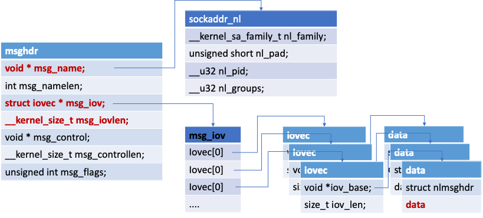

 

内核空间使用了一个消息结构`msghdr`用来存放所有的数据结构,其原型如下：

```c
	struct msghdr {
		void * msg_name;  	/*Socket 名称*/
		int msg_namelen;	/*Socket 名称长度*/
		struct iovec* msg_iov;/*向量，存放数据*/
		__kernel_size_t msg_iovlen;/*向量数量*/
		void * msg_control;/*协议幻数*/
		__kernel_size_t msg_controllen;/*msg_control的数量*/
		unsigned msg_flags;/*消息选项*/
	}
```

结构成员`msg_name`和`msg_namelen`中存放发送方的地址相关的信息.一个向量放在`msg_iov`中, 存放接收到的数据.向量成员`iov_base`指向用户传入的接收数据缓冲区地址,`iov_len`为用户传入缓冲区长度.



```c
struct nlmsghdr{
    __u32 nlmsg_len;/*整个netlink消息的长度,包含消息头*/
    __u32 nlmsg_pid;/*消发送端口的ID号，对于内核来说该值就是0，对于用户进程来说就是其socket所绑定的ID号*/
    __u16 nlmsg_flags;/*消息标记，内核在include/uapi/linux/netlink.h中定义以下6种通用的消息标记*/
    __u16 nlmsg_type;/*消息状态，内核在include/uapi/linux/netlink.h中定义以下4种通用的消息类型。*/
    __u32 nlmsg_seq;/*消息序列号，用以将消息排队有些类似TCP协议中的序号(不完全一样)，但是netlink的这个字段是可选的，不强制使用。*/
}
```

```c
/*选读 按照vmac中设置就行,不用管太细节*/
nlmsg_type：

#define NLMSG_NOOP        0x1    /* Nothing.        */----------------不执行任何动作，必须将该消息丢弃。
#define NLMSG_ERROR        0x2    /* Error        */------------------消息发生错误。
#define NLMSG_DONE        0x3    /* End of a dump    */---------------标识分组消息的末尾。
#define NLMSG_OVERRUN        0x4    /* Data lost        */------------缓冲区溢出，表示某些消息已经丢失。

#define NLMSG_MIN_TYPE        0x10    /* < 0x10: reserved control messages */


nlmsg_flags：

/* Flags values */
#define NLM_F_REQUEST        0x01    /* It is request message.     */
#define NLM_F_MULTI        0x02    /* Multipart message, terminated by NLMSG_DONE */
#define NLM_F_ACK        0x04    /* Reply with ack, with zero or error code */
#define NLM_F_ECHO        0x08    /* Echo this request         */
#define NLM_F_DUMP_INTR        0x10    /* Dump was inconsistent due to sequence change */
#define NLM_F_DUMP_FILTERED    0x20    /* Dump was filtered as requested */
```

